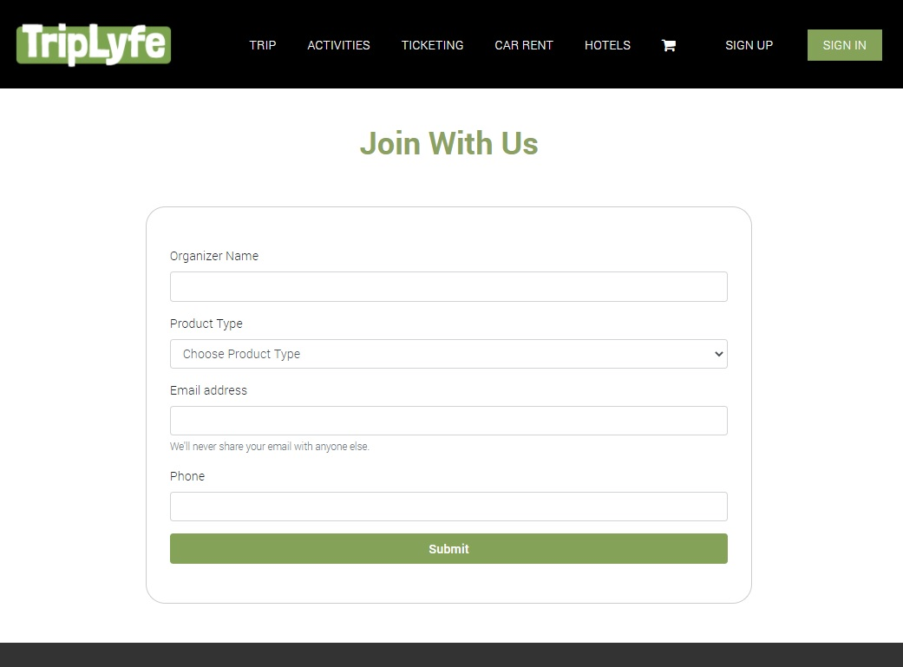
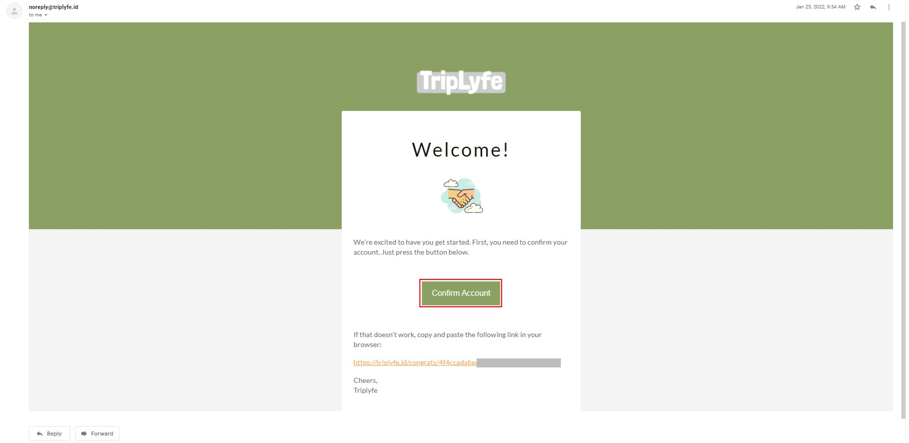

===========================
Travel Organizer
===========================

Registrasi sebagai Tour Organizer
===================================

Platform TripLyfe ID memberi peluang kepada pengguna untuk menjangkau pelanggan yang lebih luas dengan membuak akses ke pasar pengguna 
TripLyfe dan juga memberikan tools yang diperlukan untuk mengelola sebuah Tour Organizer.

Berikut beberapa langkah yang dilakukan untuk mendaftar menjadi Tour Organizer :

- Buka browser, masukkan alamat url: https://triplyfe.id/joinOrganizer

|

- Pada menu yang muncul, isi field-field yang ada sesuai dengan data yang Anda miliki. 
  Parameters:

   - ``Organizer Name``: Isi dengan nama entitas tour organizer Anda;
   - ``Product Type``: ``"Open Trip"``, ``"Car Rent"``, ``"Hotel/Villa"``, ``"Ticketing"`` Pilih kategori usaha yang ditawarkan;
   - ``Email Address``: Isi dengan alamat email;
   - ``Phone``: Isi dengan nomor telephone aktif;

- Setelah selesai mengisi field-field yang diperlukan, klik tombol :guilabel:`SUBMIT`.

- Demi kepentingan pengguna, untuk menghindari kemungkinan Anda didaftarkan oleh orang yang tidak berkepentingan, triplyfe.id akan mengirimkan email konfirmasi melalui 
  alamat email yang telah Tripster masukkan sebelumnya. Klik :guilabel:`Confirm Account`, dengan demikian Anda telah resmi menyandang sebutan Tripster dan berhak atas 
  fitur-fitur yang kami tawarkan.

|    